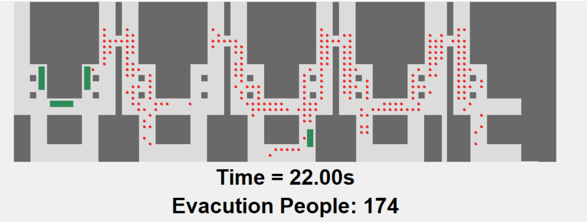
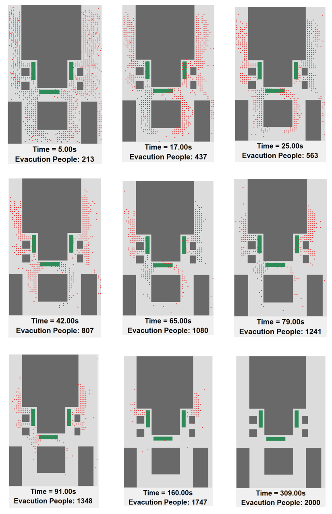
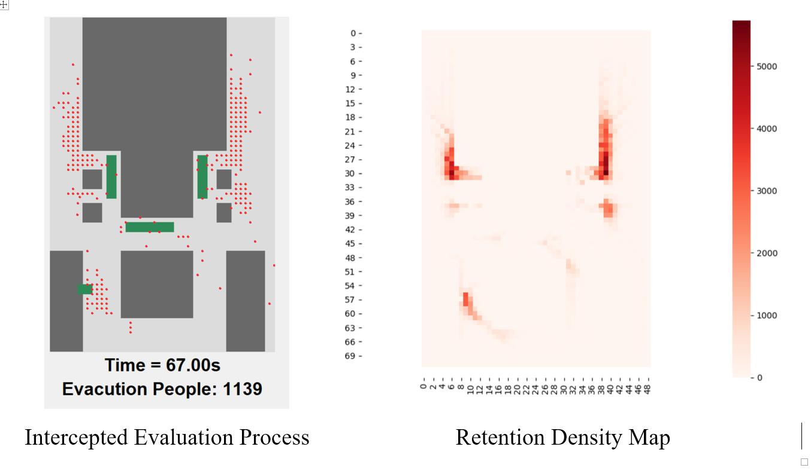

# 卢浮宫疏散计算机模拟

## 总览

使用Python编程实现人员疏散模拟

包含三个模块 `main.py` `map.py` `people.py`

## 示意图

## 文件

### main.py

界面实现，包含GUI类，显示地图、人员、疏散情况等信息

### map.py
地图类，地图以点(px, py)集形式保存出口Exit位置及障碍物Barrier位置  
出口对地图的势能初始化：利用BFS算法实现，多个出口取最小势能

### people.py
包含两个类，Person类和People类，前者只有移动速度、位置等基本属性，后者包含了整个地图信息，人流密度等，方便指引每个人的移动

## 有待改进之处

模型人员移动策略可以修改为：
  - 只设置一定比例的人员（作为安保/疏导人员）能够自动走到出口
  - 其他人员随机走动/从众心理跟着人流走动

考虑人员增加更多属性，如年龄、性别、是否结队等
  - 不同年龄人群移动速度不同
  - 家人、朋友等同行人员等使用相同的移动策略
  - 男性群体可能更理性，倾向于走最短路径/避让人群

## 编程收获

  - 再次熟悉使用了`pkinter`实现GUI，并再次利用plt作图（热力图）
  - 深刻领会了 Python 的赋值、引用、拷贝问题 ：可变对象之间的赋值是传引用，不可变对象的赋值是传值。详见[博客](https://blog.csdn.net/dta0502/article/details/80827359)
  - 求解最短路要注意连通性！！！初始距离设为无穷大可避免出现更新距离问题（不连通的区块距离为0导致错误）
  - 对矩阵np.array的访问，下标为浮点数只会报Warning，改了好久值类型dtype才发现下标为浮点数！

  

